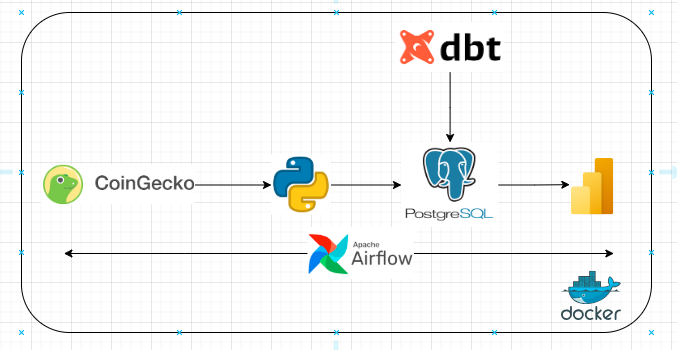

# 🚀 Crypto Data Engineering Pipeline (Python + Postgres + dbt + Airflow + Docker)

## **Overview**
This project is an **end-to-end data engineering pipeline** that ingests cryptocurrency data from the **CoinGecko API**, loads it into a **PostgreSQL `raw` schema**, transforms it into `curated` and `processed` layers using **dbt**, and prepares **reporting views** for **Power BI**.  
The entire workflow is orchestrated using **Apache Airflow** and runs seamlessly inside **Docker containers**.

---

## **Architecture**


## **🛠 Tech Stack**
- 🐍 **Python** – Data ingestion from CoinGecko API  
- 🌬 **Apache Airflow** – Workflow orchestration  
- 🧱 **dbt** – SQL-based transformations and testing  
- 🗄 **PostgreSQL** – Data warehouse with layered schemas  
- 🐳 **Docker & docker-compose** – Containerized setup  
- 📊 **Power BI** – Reporting and dashboards  

## **✨ Features**
- 🔄 Automated data ingestion pipeline using Airflow DAGs.  
- 🏗 **Layered architecture:** raw → curated → processed → report.  
- 🧪 **dbt** for transformations, tests, and documentation.  
- ⭐ **Star schema** with dim and fact tables in the processed schema.  
- 📈 Reporting views ready for Power BI in the report schema.  
- 🐳 Fully containerized and reproducible using Docker Compose.  

## **📂 Project Structure**
```bash
project-crypto-dbt-airflow/
├── airflow-dags/             
│   └── airflow_pipeline.py     # airflow pipeline
├── dbt_crypto_project/
│   ├── models/                 # dbt transformatio logic
│   │   ├── curated/
│   │   ├── processed/
│   │   └── reporting/
│   └── dbt_project.yml
├── scripts/
│   ├── ingest_crypto_data.py   # python ingestion
├── powerBi                     # dashboard sample
├── docker-compose.yml
├── Dockerfile
├── Dockerfile.airflow          # configuire airflow with dbt and libraries
├── requirements.txt
└── README.md
```
⚡ Setup Instructions
1. Clone the repository
2. Setup Docker in local machine
3. Inside the local folder that contains the project and docker files run docker build commands

```bash
docker compose up     #containers up -d
docker ps             #containers should be visible

#initialise the dbt project
docker-compose run airflow airflow db init
 
# create profiles.yml
docker-compose run airflow airflow users create --username airflow --password airflow --firstname Data --lastname Engineer --role Admin --email data@engineer.com
```

This will start:

🗄 PostgreSQL

🌬 Airflow Webserver & Scheduler

🧱 dbt container

## **Access Services**
🌐 Airflow UI: http://localhost:8080

🗄 PostgreSQL: localhost:5432

## **Check Airflow**
Open port at localhost:8080 from browser Airflow should be visible.


## **Trigger the DAG**
The DAG should complete with 2 tasks Python and DBT


## **Verify data from postgres**
I have connected to postgres from DBeaver
- **host**: localhost:5432
- **user**: airflow
- **password**: airflow


## **Star Schema**


## **Simple PowerBI report**


## **Common errors**
1. **Logs folder error**: give permission
```bash
rmdir /s /q .\dbt_crypto_project\logs
mkdir .\dbt_crypto_project\logs
icacls .\dbt_crypto_project\logs /grant Everyone:F /T
```
2. **Target folder error**: give permission
```bash
docker exec -it airflow bash    #verify container name
rm -rf /opt/dbt/target
mkdir -p /opt/dbt/target
chmod -R 777 /opt/dbt/target
```

## 👨‍💻 **About the Author**
I am Sayon Bhattacharjee, a passionate Data Engineer with expertise in building scalable and modern data pipelines using multicloud and diverse range of Big Data technologies.
I love solving real-world data challenges, optimizing workflows, and exploring cutting-edge tools to deliver high-quality, production-ready solutions.

🔗 [LinkedIn](https://www.linkedin.com/in/sayon-bhattacharjee-a33380218/)
